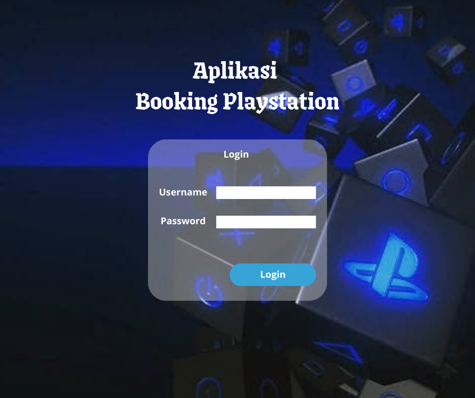
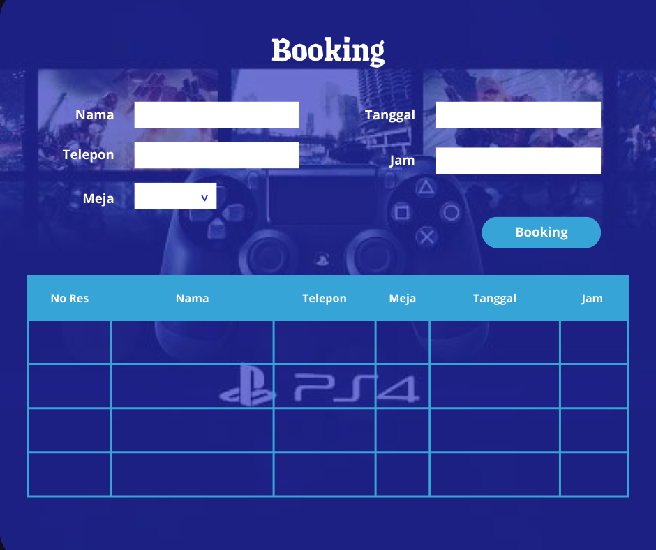

Tampilan Login

Tampilan Login

Judul Proyek:
Aplikasi Booking PlayStation untuk Admin Berbasis Desktop dengan Database MySQL

Deskripsi Singkat:
Aplikasi ini dirancang untuk membantu admin dalam mengelola pemesanan (booking) PlayStation secara efisien. Aplikasi berbasis desktop ini terhubung dengan database MySQL untuk menyimpan dan mengelola data secara terstruktur.

Fitur Utama:

Login Admin:
Admin harus melakukan login terlebih dahulu untuk dapat mengakses sistem. Fitur ini berfungsi untuk membatasi akses hanya bagi pengguna yang memiliki akun terdaftar.

Manajemen Booking:
Admin dapat melihat, menambahkan, mengedit, dan menghapus data booking. Data yang dikelola mencakup nama pelanggan, tanggal booking, durasi bermain, dan status pembayaran.

Data Booking:
Semua data booking disimpan di database MySQL. Admin dapat meninjau histori booking serta mencari data berdasarkan tanggal atau nama pelanggan.

Teknologi yang Digunakan:
Bahasa Pemrograman: C# (atau bahasa lain sesuai kebutuhan)
Database: MySQL
Tools: Visual Studio, MySQL Workbench (atau phpMyAdmin)

Tujuan:
Memberikan solusi praktis bagi pengelola rental PlayStation untuk mengelola jadwal dan data booking pelanggan secara digital dan terstruktur.
